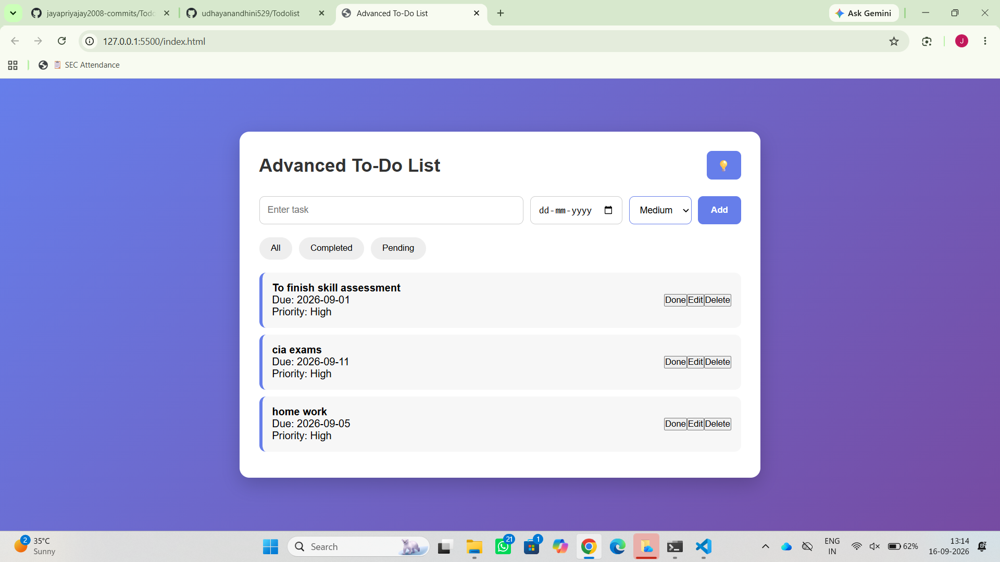

# Ex03 To-Do List using JavaScript
## Date:

## AIM
To create a To-do Application with all features using JavaScript.

## ALGORITHM
### STEP 1
Build the HTML structure (index.html).

### STEP 2
Style the App (style.css).

### STEP 3
Plan the features the To-Do App should have.

### STEP 4
Create a To-do application using Javascript.

### STEP 5
Add functionalities.

### STEP 6
Test the App.

### STEP 7
Open the HTML file in a browser to check layout and functionality.

### STEP 8
Fix styling issues and refine content placement.

### STEP 9
Deploy the website.

### STEP 10
Upload to GitHub Pages for free hosting.

## PROGRAM

index.html
```
<!DOCTYPE html>
<html lang="en">
<head>
    <meta charset="UTF-8">
    <meta name="viewport" content="width=device-width, initial-scale=1.0">
    <title>Advanced To-Do List</title>

    <link rel="stylesheet" href="style.css">
</head>

<body>

    <div class="container">

        <div class="top-bar">
            <h1>Advanced To-Do List</h1>

            <button id="themeBtn">💡</button>
        </div>

        <div class="input-section">

            <input 
                type="text" 
                id="taskInput" 
                placeholder="Enter task"
            >

            <input 
                type="date" 
                id="dueDate"
            >

            <select id="priority">
                <option value="High">High</option>
                <option value="Medium">Medium</option>
                <option value="Low">Low</option>
            </select>

            <button id="addBtn">Add</button>

        </div>

        <div class="filter-section">

            <button 
                class="filter-btn" 
                data-filter="all"
            >
                All
            </button>

            <button 
                class="filter-btn" 
                data-filter="completed"
            >
                Completed
            </button>

            <button 
                class="filter-btn" 
                data-filter="pending"
            >
                Pending
            </button>

        </div>

        <ul id="taskList"></ul>

    </div>

    <!-- IMPORTANT -->
    <script src="script.js"></script>

</body>
</html>
```
style.css
```
*{
    margin:0;
    padding:0;
    box-sizing:border-box;
}

body{
    font-family:Arial, sans-serif;
    background:linear-gradient(135deg,#667eea,#764ba2);
    min-height:100vh;
    display:flex;
    justify-content:center;
    align-items:center;
}

/* MAIN CONTAINER */

.container{
    width:90%;
    max-width:800px;
    background:white;
    padding:30px;
    border-radius:15px;
    box-shadow:0 10px 30px rgba(0,0,0,0.2);
}

/* TOP BAR */

.top-bar{
    display:flex;
    justify-content:space-between;
    align-items:center;
    margin-bottom:25px;
}

.top-bar h1{
    color:#333;
    font-size:28px;
}

#themeBtn{
    border:none;
    background:#667eea;
    color:white;
    padding:10px 14px;
    border-radius:8px;
    cursor:pointer;
    font-size:18px;
}

/* INPUT SECTION */

.input-section{
    display:flex;
    gap:10px;
    margin-bottom:20px;
}

.input-section input,
.input-section select{
    padding:12px;
    border:1px solid #ccc;
    border-radius:8px;
    outline:none;
    font-size:14px;
}

#taskInput{
    flex:1;
}

.input-section input:focus,
.input-section select:focus{
    border-color:#667eea;
}

/* ADD BUTTON */

#addBtn{
    background:#667eea;
    color:white;
    border:none;
    padding:12px 20px;
    border-radius:8px;
    cursor:pointer;
    font-weight:bold;
}

#addBtn:hover{
    background:#5568d8;
}

/* FILTER SECTION */

.filter-section{
    display:flex;
    gap:10px;
    margin-bottom:20px;
}

.filter-btn{
    padding:9px 18px;
    border:none;
    border-radius:20px;
    background:#eee;
    cursor:pointer;
}

.filter-btn:hover{
    background:#667eea;
    color:white;
}

/* TASK LIST */

#taskList{
    list-style:none;
}

/* TASK ITEM */

#taskList li{
    display:flex;
    justify-content:space-between;
    align-items:center;
    background:#f7f7f7;
    padding:15px;
    margin-bottom:10px;
    border-radius:10px;
    border-left:5px solid #667eea;
}

/* RESPONSIVE DESIGN */

@media(max-width:700px){

    .input-section{
        flex-direction:column;
    }

    .container{
        padding:20px;
    }

    .top-bar h1{
        font-size:22px;
    }

    .filter-section{
        flex-wrap:wrap;
    }

}
script.js
```
const addBtn = document.getElementById("addBtn");
const taskInput = document.getElementById("taskInput");
const taskList = document.getElementById("taskList");

const dueDate = document.getElementById("dueDate");
const priority = document.getElementById("priority");

const themeBtn = document.getElementById("themeBtn");

const filterButtons = document.querySelectorAll(".filter-btn");


// TASK ARRAY
let tasks = [];


// SAVE TASKS
function saveTasks() {
    localStorage.setItem("tasks", JSON.stringify(tasks));
}


// LOAD TASKS
function loadTasks() {

    const storedTasks = localStorage.getItem("tasks");

    if(storedTasks) {
        tasks = JSON.parse(storedTasks);
    }

    displayTasks();
}


// DISPLAY TASKS
function displayTasks(filter = "all") {

    taskList.innerHTML = "";

    tasks.forEach((task, index) => {

        // FILTER CONDITIONS
        if(filter === "completed" && !task.completed){
            return;
        }

        if(filter === "pending" && task.completed){
            return;
        }

        // CREATE LIST ITEM
        const li = document.createElement("li");

        // TASK INFO
        const taskInfo = document.createElement("div");
        taskInfo.classList.add("task-info");

        if(task.completed){
            taskInfo.classList.add("completed");
        }

        // PRIORITY CLASS
        let priorityClass = "";

        if(task.priority === "High"){
            priorityClass = "high";
        }
        else if(task.priority === "Medium"){
            priorityClass = "medium";
        }
        else{
            priorityClass = "low";
        }

        taskInfo.innerHTML = `
            <strong>${task.text}</strong>
            <div>Due: ${task.date || "No Date"}</div>
            <div class="priority ${priorityClass}">
                Priority: ${task.priority}
            </div>
        `;

        // BUTTON CONTAINER
        const buttonDiv = document.createElement("div");
        buttonDiv.classList.add("task-buttons");

        // DONE BUTTON
        const doneBtn = document.createElement("button");

        doneBtn.innerText = "Done";
        doneBtn.classList.add("complete-btn");

        doneBtn.addEventListener("click", function(){

            tasks[index].completed = !tasks[index].completed;

            saveTasks();
            displayTasks(filter);
        });

        // EDIT BUTTON
        const editBtn = document.createElement("button");

        editBtn.innerText = "Edit";
        editBtn.classList.add("edit-btn");

        editBtn.addEventListener("click", function(){

            const updatedTask = prompt("Edit Task", task.text);

            if(updatedTask !== null && updatedTask.trim() !== ""){

                tasks[index].text = updatedTask;

                saveTasks();
                displayTasks(filter);
            }
        });

        // DELETE BUTTON
        const deleteBtn = document.createElement("button");

        deleteBtn.innerText = "Delete";
        deleteBtn.classList.add("delete-btn");

        deleteBtn.addEventListener("click", function(){

            tasks.splice(index, 1);

            saveTasks();
            displayTasks(filter);
        });

        // APPEND BUTTONS
        buttonDiv.appendChild(doneBtn);
        buttonDiv.appendChild(editBtn);
        buttonDiv.appendChild(deleteBtn);

        // APPEND ELEMENTS
        li.appendChild(taskInfo);
        li.appendChild(buttonDiv);

        taskList.appendChild(li);
    });
}


// ADD TASK
addBtn.addEventListener("click", function(){

    const text = taskInput.value.trim();

    if(text === ""){
        alert("Please enter a task");
        return;
    }

    const task = {

        text: text,
        date: dueDate.value,
        priority: priority.value,
        completed: false
    };

    tasks.push(task);

    saveTasks();
    displayTasks();

    // CLEAR INPUTS
    taskInput.value = "";
    dueDate.value = "";
});


// FILTER BUTTONS
filterButtons.forEach(function(button){

    button.addEventListener("click", function(){

        const filter = button.dataset.filter;

        displayTasks(filter);
    });
});


// DARK / LIGHT MODE
themeBtn.addEventListener("click", function(){

    document.body.classList.toggle("light-mode");

    if(document.body.classList.contains("light-mode")){
        themeBtn.innerText = "☀️";
    }
    else{
        themeBtn.innerText = "🌙";
    }
});


// LOAD TASKS ON START
loadTasks();


## OUTPUT


## RESULT

The program for creating To-do list using JavaScript is executed successfully.
